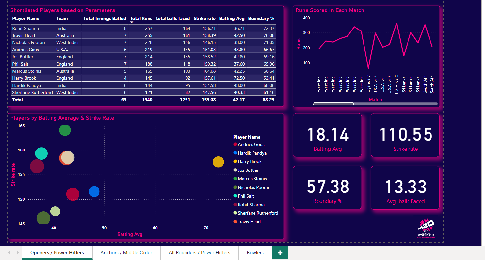
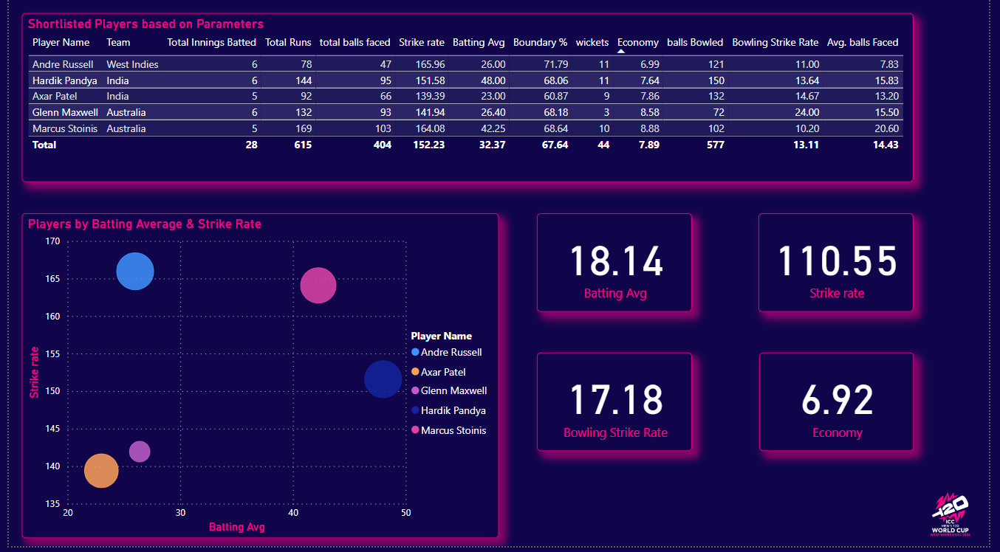
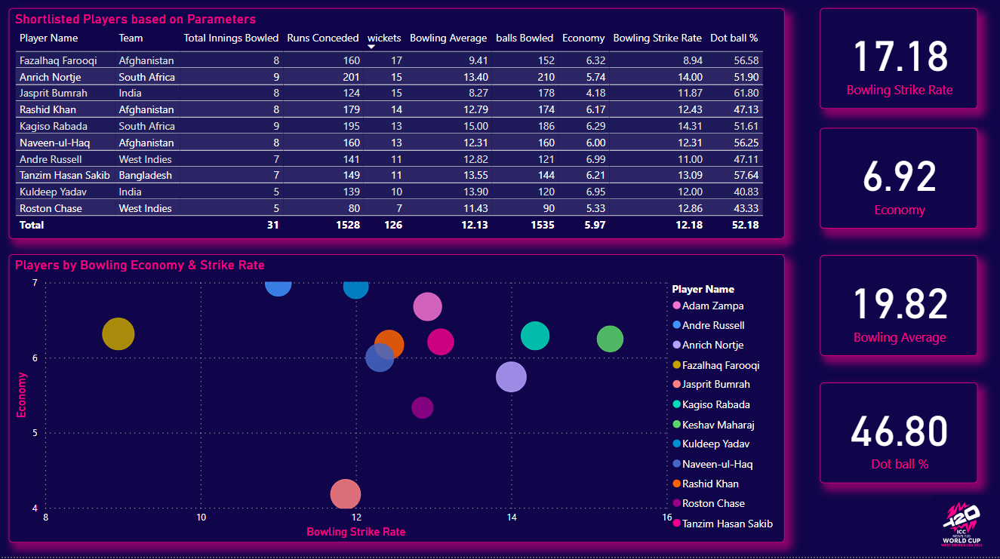

# ICC Men's T20 World Cup 2024 Analysis

## Overview

This project involves the comprehensive analysis of the ICC Men's T20 World Cup 2024. The data was scraped from ESPN Cricinfo using Scrapy, processed with Python and Power Query, and visualized using Power BI. The main objective was to select the Team of the Tournament based on predefined criteria.

## Project Repository

This repository contains the following files:

- **batting_summary.csv**: Detailed summary of batting performances.
- **bowling_summary.csv**: Detailed summary of bowling performances.
- **match_results.csv**: Summary of match results.
- **players.csv**: List of all players and their respective teams in the ICC Men's T20 World Cup 2024.
- **scrapy_spider_batting.py**: Scrapy spider script for scraping batting data.
- **scrapy_spider_bowling.py**: Scrapy spider script for scraping bowling data.

## Visualization with Power BI and Selecting the Best Eleven

Below are some screenshots of the Power BI dashboards created to visualize the data and assist in selecting the Team of the Tournament.

### Openers Dashboard
For the openers, I wanted those players who scored more and at a good strike rate since in the power play only two fielders are outside the 30-yard circle and this is the time to score big. Teams scoring more in the powerplay tend to have a strong grip throughout the game.

Focused on players with high strike rates and significant boundary percentages. Criteria included a batting average >30, strike rate >140, and boundary percentage >50%.

Rohit Sharma and Travis Head emerged as the premier candidates for the opener positions, each amassing over 250 runs in the tournament with impressive strike rates exceeding 155, showcasing their ability to dominate during the powerplay.

Nicholas Pooran from the West Indies also had an outstanding tournament, scoring over 200 runs with a commendable strike rate. His inclusion at the number three spot not only bolsters the batting lineup but also fills the crucial wicketkeeper role.

### Middle Order Dashboard
For the middle order, I needed a dependable batsman with a strong batting average, capable of forging crucial partnerships if the openers falter. Criteria included a batting average >40 and strike rate >120.

Andries Gous from the U.S.A. and Marcus Stoinis from Australia were my selections for the 4th and 5th batting positions, respectively. Gous impressed with over 200 runs and a solid batting average, making him a reliable player to take the game deep. Stoinis, while not amassing as many runs, showcased a commendable batting average and strike rate, coupled with the added advantage of his bowling capabilities.

### All Rounders Dashboard
Selecting all-rounders required players who could significantly contribute with both bat and ball, and finish the game. The criteria included a batting average over 20, a strike rate over 130, and having bowled in more than two innings.

Hardik Pandya from India was an obvious choice, boasting 144 runs at a strike rate exceeding 150, along with 11 wickets and an economy rate under 8.

The decision between Andre Russell (West Indies) and Axar Patel (India) was challenging. However, I chose Axar Patel due to his ability to bat in the middle order and offer a spin option, whereas Andre Russell, being a medium-paced bowler, was less crucial given the already selected pace bowlers Hardik Pandya and Marcus Stoinis.

### Bowlers Dashboard
Effective bowlers with low economy rates and high strike rates were essential. The criteria included a bowling average below 20, a strike rate under 16, and an economy rate less than 7.

Fazalhaq Farooqi from Afghanistan, being the highest wicket-taker with 18 wickets, was an automatic choice. Alongside him, Rashid Khan from Afghanistan provided a spin option with 14 wickets. Jasprit Bumrah from India, with 15 wickets and an economy rate under 5, and Anrich Nortje from South Africa, also with 15 wickets and an economy rate under 6, completed the bowling lineup.

## Team of the Tournament

### Openers
- **Rohit Sharma**: Over 250 runs in the tournament with a strike rate greater than 155, making him a top contender for the opener position.
- **Travis Head**: Similar performance as Rohit Sharma with exceptional runs and strike rate.

### Middle Order
- **Nicholas Pooran**: With over 200 runs and a good strike rate, Pooran fills the number 3 position and the wicketkeeper slot.
- **Andries Gous (U.S.A.)**: Scored over 200 runs with a reliable batting average, perfect for creating partnerships.
- **Marcus Stoinis (Australia)**: Offers a good batting average, strike rate, and the added benefit of being a bowler.

### All Rounders
- **Hardik Pandya (India)**: An easy pick with 144 runs, a strike rate greater than 150, 11 wickets, and an economy less than 8.
- **Axar Patel (India)**: Selected for his ability to bat in the middle order and provide a spin option.

### Bowlers
- **Fazalhaq Farooqi (Afghanistan)**: Highest wicket-taker with 18 wickets.
- **Rashid Khan (Afghanistan)**: Provides a spin option with 14 wickets.
- **Jasprit Bumrah (India)**: 15 wickets with an economy less than 5.
- **Anrich Nortje (South Africa)**: 15 wickets with an economy less than 6.

## Dataset Descriptions

### Batting Summary CSV
Contains detailed batting performance data, including runs, balls faced, strike rate, and more.

### Bowling Summary CSV
Contains detailed bowling performance data, including wickets taken, economy rate, strike rate, and more.

### Match Results CSV
Contains the summary of match results, including the teams involved, scores, and outcomes.

### Players CSV
Lists all players who participated in the ICC Men's T20 World Cup 2024 along with their respective teams.

## Conclusion

This project demonstrates the power of data scraping, processing, and visualization in selecting the Team of the Tournament for the ICC Men's T20 World Cup 2024. The criteria-based selection process ensures that the best performers are highlighted based on their contributions throughout the tournament.
