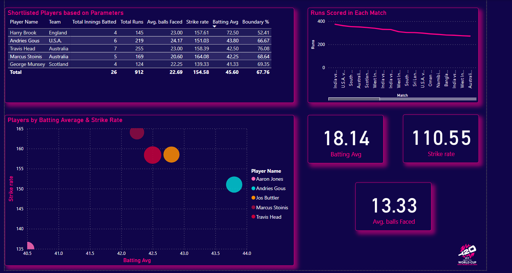

# ICC Men's T20 World Cup 2024 Analysis

## Overview

This project involves the comprehensive analysis of the ICC Men's T20 World Cup 2024. The data was scraped from ESPN Cricinfo using Scrapy, processed with Python and Power Query, and visualized using Power BI. The main objective was to select the Team of the Tournament based on predefined criteria.

## Project Repository

This repository contains the following files:

- **batting_summary.csv**: Detailed summary of batting performances.
- **bowling_summary.csv**: Detailed summary of bowling performances.
- **match_results.csv**: Summary of match results.
- **players.csv**: List of all players and their respective teams in the ICC Men's T20 World Cup 2024.
- **scrapy_spider_batting.py**: Scrapy spider script for scraping batting data.
- **scrapy_spider_bowling.py**: Scrapy spider script for scraping bowling data.

## Dashboards

Below are some screenshots of the Power BI dashboards created to visualize the data and assist in selecting the Team of the Tournament.

### Openers Dashboard

### Middle Order Dashboard

### All Rounders Dashboard

### Bowlers Dashboard

## Team of the Tournament

### Openers
- **Rohit Sharma**: Over 250 runs in the tournament with a strike rate greater than 155, making him a top contender for the opener position.
- **Travis Head**: Similar performance as Rohit Sharma with exceptional runs and strike rate.

### Middle Order
- **Nicholas Pooran**: With over 200 runs and a good strike rate, Pooran fills the number 3 position and the wicketkeeper slot.
- **Andries Gous (U.S.A.)**: Scored over 200 runs with a reliable batting average, perfect for creating partnerships.
- **Marcus Stoinis (Australia)**: Offers a good batting average, strike rate, and the added benefit of being a bowler.

### All Rounders
- **Hardik Pandya (India)**: An easy pick with 144 runs, a strike rate greater than 150, 11 wickets, and an economy less than 8.
- **Axar Patel (India)**: Selected for his ability to bat in the middle order and provide a spin option.

### Bowlers
- **Fazalhaq Farooqi (Afghanistan)**: Highest wicket-taker with 18 wickets.
- **Rashid Khan (Afghanistan)**: Provides a spin option with 14 wickets.
- **Jasprit Bumrah (India)**: 15 wickets with an economy less than 5.
- **Anrich Nortje (South Africa)**: 15 wickets with an economy less than 6.

## Dataset Descriptions

### Batting Summary CSV
Contains detailed batting performance data, including runs, balls faced, strike rate, and more.

### Bowling Summary CSV
Contains detailed bowling performance data, including wickets taken, economy rate, strike rate, and more.

### Match Results CSV
Contains the summary of match results, including the teams involved, scores, and outcomes.

### Players CSV
Lists all players who participated in the ICC Men's T20 World Cup 2024 along with their respective teams.

## Conclusion

This project demonstrates the power of data scraping, processing, and visualization in selecting the Team of the Tournament for the ICC Men's T20 World Cup 2024. The criteria-based selection process ensures that the best performers are highlighted based on their contributions throughout the tournament.
